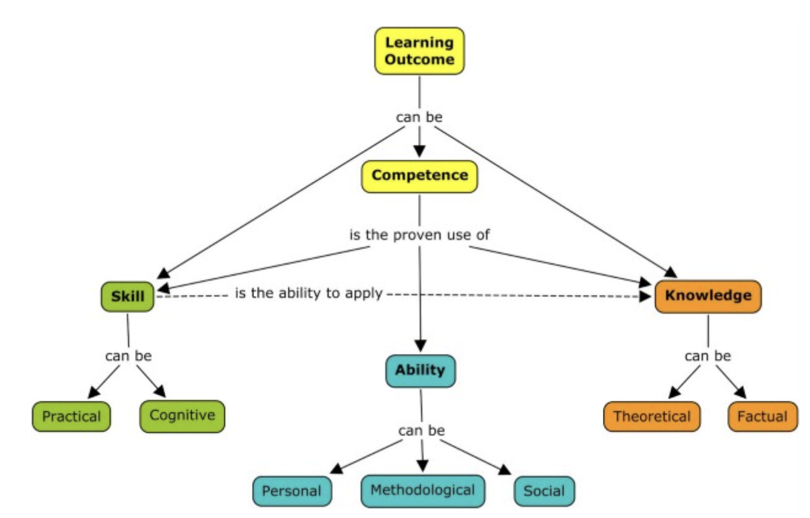

# Keywords {-}
Data Science, Authentic Assessment, Equity Grading, Project Based Learning, Formative and Summative Assessments

# Introduction
Two forces, ubiquity of data collection of various types (such as images, video, sound, among others) and an increase in computing power to transform those complex data types to information, has accelerated the use of advanced black box models. There is now an urgent need to upskill the future data scientist and ML engineers not only with how to perform data analysis but also an intuitive understanding of the inner workings of the black box approaches. This starts with understanding the simplest of approaches involved in an end-to-end data analysis project. At San Jose State University, we have re-imagined the applied statistics and probability for engineers course to include foundational concepts from matrix algebra and optimization disciplines. Expanding the topics in this way presents an opportunity for students to see the process of translating real world problems into an analytic form, subsequently followed by collecting and preparing data to statistical inference and prediction. Typically the matrix decomposition and factorization based approaches for feature engineering and inference are taught as a separate semester-long course. That is also true for calculus based optimization routines  for parameter estimation. Often different teaching styles and depth of topics covered results in students developing weak connections. We are not debating the importance of having semester-long courses for a deep learning of topics, instead argue for at least one course in the curriculum that views the representative problem of the curriculum from a systems engineer perspective [@lucas2016thinking] and provide end to end understanding of the approaches involved in data analysis. We have observed that this approach makes the learners develop stronger connections among the concepts and prepare them better for deep treatment of the topics.

The new course hence developed, 'Math Foundations for Decision and Data Science, is a core course for the pursuants of graduate degree in Engineering Management, Industrial & Systems Engineering and Artificial Intelligence. It would become immediately apparent to the reader that the career goals of the students pursuing these degrees would be different. There is also a strong possibility that the students enter the program with different levels of exposure to these concepts. The commonality among the students is their desire to pursue professional careers using data skills.  

In recent years there has been growth in adoption of open source software and availability of public domain data. This has created an interesting scenario of using evidence based data science skills for screening candidates [@udacity_2021]. Hiring companies now regularly do hands-on problem solving, and occasionally host data competitions on platforms like Kaggle to reduce the pool of applicants. Merely studying the course is no longer sufficient, having experiential evidence either as an active github repository or long form written blogs or a rudimentary web application is becoming increasingly desirable.

The challenge then as an instructor becomes organizing the content and designing assessments that would not only meet the needs of the mixed experience level students but also enable them to meet the demands of the companies hiring for data skills. 

# Authentic Assessment
The need of the students is to develop hands-on understanding of approaches for turning unstructured data into information. This includes being able to manipulate data using statistical software and draw inferences based on the understanding of the approaches. To translate that into a lesson plan, it is essential first to catalog concepts students need to master and assessments to evaluate if that objective was achieved. That is in essence the philosophy of reverse instructional design, [@wiggins2005understanding]. Among the different types of assessments, the first step is to design the high stakes cumulative assessments (also known as summative assessment) subsequently followed by designing low stakes assessments that would serve as scaffolding assessments (or formative assessment) and eventually resulting in development of lesson plans. A more nuanced distinction among the different types of assessments can be found in the paper [@harlen1997assessment]. 

An important guiding concept in rethinking course delivery is authentic assessment [@wiggins1989true], [@wiggins1998educative]. It has been explained as , “... representative challenges within a given discipline. They are designed to emphasize realistic (but fair) complexity; they stress more on depth over breadth. In doing so, they must necessarily involve somewhat ambiguous, ill-structured tasks or problems.” [@wiggins_27c_2022]. The article lists various characteristics of authentic tasks. In particular it clarifies distinction between hands-on and real world learning by stating that the latter focuses on the impact of the solution versus the former focuses on creating or building artifacts as a demonstration of understanding. There has been some work of interpreting what authentic assessment means for a statistics class over the years [@garfield2000assessment], [@joan1994beyond], [@garfield2007students], [@libman2010integrating]. The needs of the industry and the students have evolved since then. In this paper we revisit the assessments ensuring the assessments meet the guidelines [@chance1997experiences] among others of timely and constructive feedback and opportunity for reflection among the students. 

Another useful concept is the connection between knowledge, skill and course learning objectives [@toikkanen_2016], illustrated in Figure 1. Developing hands-on data analysis skill is crucial not only for demonstration of the knowledge but also understanding of the concepts, succinctly put as "students learn best when they practice and perform on their own" [@tishkovskaya2012statistical]. 

```{r, echo=FALSE, out.width="90%", fig.cap="Relaionship between knowledge, skill and course learning outcome from Focus on skill mastery, not knowledge acquisition by Toikkanen"}

```


# Designing Assessments
An authentic cumulative assessment for a data analysis course is a data analysis project. For learners getting started in the field that would include understanding data using descriptive statistics, visualizations of trends and patterns, data quality checks, feature preprocessing, statistical inference to test hypotheses and a predictive model (simple linear regression or logistic regression). For the course, the project was split into three intermediate submissions, the first one around data selection and data quality checks, second on performing exploratory data analysis and generating hypotheses, third using statistical inference and predictive models. To make it authentic, students were given the agency to select a dataset that interested them [@opendata_2021].The tasks were inherently unstructured due to the fact that the students picked a different dataset with different challenges, but the task was scaffolded by providing a rubric to set expectations and providing guiding questions to walk them through the thought process of the analysis. Data analysis projects are part of data science courses, and are usually implemented as a group project[@ccetinkaya2021fresh]. We propose individual data analysis projects with peer evaluations for selected milestones. 

Aware of the potential failings of unstructured projects [@kirschner2010minimal], we developed formative assessments that scaffolded skills required for the final project but on preprocessed data and better defined tasks. This enabled the students to focus on the approach and interpretation one task at a time.

To balance experiential learning, the assessments also needed to evaluate for understanding of concepts. For this course, that was implemented as a multiple choice quiz. This form of assessment was focused on topic specific understanding so it was delivered after the end of each of the four modules, namely linear algebra, probability, statistics & optimization.

Finally the lessons were then designed to demonstrate the mathematics of the approaches and illustrated the concepts with applications and in-class worked-out examples.

## Equity grading
The change in course assignments was designed and implemented during the 2020 COVID pandemic and inequity in the circumstances made it urgent to address the inequity in student learning. Elements of equity grading [@feldman2018grading] were incorporated by allowing resubmission of the assignments and quizzes to improve understanding. The resubmissions specifically focussed on fixing the gaps in understanding. It also included a reflection component for students to become aware of their learning patterns.  The other aspect of equity grading was removing the penalty for late submissions. This drastically reduced missing submissions. Homework assignments and formative submissions focused on practicing statistical programming language such as R/Python skills. Creating milestones for the project submissions, reduced the cognitive load of planning for an end to end data analysis project. 

## Pedagogy Effectiveness
From the informal discussion with the students during class and office hour, the students reported finding value in the project component. Every semester a survey is sent to all the students to evaluate teacher and teaching effectiveness. The survey has ten questions and one among them is "Used assignments that enhanced learning." The score on this question was used to compare against the delivery of the same content in two semesters. One with the assessments detailed in previous sections and one without. The score for the end of semester teaching evaluation question increased from 4.4 to 4.6 after implementation of the assessments described in the paper. 

## Observation and Reflection
Unstructured assignments are hard. That is not surprising for anyone who is familiar with cognitive psychology. Novice learners lack useful mental models to perform tasks efficiently as an expert [@daley1999novice]. Further most students entering this class have been part of systems where they were used to being told what to do. This was reflected in some students having difficulty in making decisions as simple as selecting a dataset. Chunking up the summative assignments that students submit over the course of a semester for feedback and improvement before submitting the final project at the end of the semester improved the quality and also reduced the stress level among the students.

By introducing authentic assignments, the challenge often encountered in a mixed skills class room was addressed. Students on both sides of the spectrum of fluency in programming skills and prior exposure to concepts felt challenged and exhibited learning. It was observed that the students chose and analyzed the dataset according to their skill and experience level in the field. Students with prior exposure picked a more nuanced dataset to challenge themselves and relatively novice students were able to exhibit similar approaches on a simpler dataset. 

Making the assignments more unstructured made it apparent as an instructor what concepts students struggle with the most[@ijeh2012competent]. Providing the opportunity to work on the corrections for credit, motivated students to fix their gap in learning. The project gave them the autonomy to apply the concepts they were learning in the class on the dataset of their choice further increased their engagement and understanding of end-to-end data analysis projects.

## Next Steps
Designing the assessments as detailed in the previous section, provided a novel perspective into gaps which the structured assignments often miss. Traditional assignments and exams provide well defined problem statements, where the student most often is tested on how they perform the analysis but less frequently on formulating the analytic problem. This enabled the instructor to develop scaffolding tasks and formative assessments to focus on particular skills. Additionally there are other pedagogies that could be incorporated to develop the student to become an independent learner. Another potential next step could be to give the choice to the student to collect data for analysis [@anderson2019turning].

# Insights and Recommendations
A systems thinking approach to designing the assessments for a foundation course can be extended to other courses as well. The key difference between novice learners and experienced learners [@daley1999novice] is the richness of the mental models and density of connections. Exposing learners to the end to end process of data analysis, including data preprocessing, asking questions and translating that into analytic questions, tasks which are often missing from traditional assessments, provides a more authentic experience. A hands-on appreciation of the iterative nature of data analysis projects makes them better prepared for the real world tasks. Applying the concepts using open source programming languages adds to their skills repertoire.

The key insight and recommendation from the experience has been to have at least one course in the curriculum that uses the systems thinking approach to the tasks in the field. A survey conducted among data science educators found that systems thinking is often omitted from the data science curriculum[@schwab2021data]. That is a lost opportunity to prepare learners to be holistic thinkers and better prepared to enter a professional world,[@busteed2019aren]. This gap can be reduced with assignments that provide a taste of the authentic challenges in the discipline. 

# Conclusion  
One might ask the question - What place does an applied project have in a Math Foundations course? Shouldn’t the learning objective be to develop mathematical fluency underlying machine learning approaches? That is an important question and the answer resides in the learners to whom this course is targeted.  As briefly mentioned in the introduction, the course attracts students from a variety of disciplines and different experience levels. Most of the students are looking to apply their education via internship or a full time job in the field. Employing a systems thinking approach in organizing the topics and designing the assessments has addressed the challenges of keeping mixed skills level class engaged, equipping the students with experiential learning using authentic tasks to become contributing professionals and tying foundational concepts from linear algebra, probability, statistics and optimization, each justifiably a semester worth topic, into one cohesive whole. The lectures focus on providing the mathematical intuition for the approaches and the assignments provide the much needed practice of application of those concepts. 

Apprenticeship has always been an excellent way to gain knowledge as they expose the student to not only learning the craft better but also learning the context. In the classroom, sometimes the context is lost  or the analysis is so tunneled that the onus is left on the student to figure out the whole life cycle. Systems thinking of designing authentic assessment and equity based grading has given the student experiential understanding of end-to-end data analysis projects. 

# Acknowledgement {-}
I would like to thank Dr. Yasser Dessouky, Professor and Chair of the ISE Department for the support and providing space for experimenting with novel pedagogies in Data Science courses. I would also like to thank my Faculty Learning Community for engaging discussions about authentic assessment and for stretching my thinking through those discussions.

**REFERENCES**