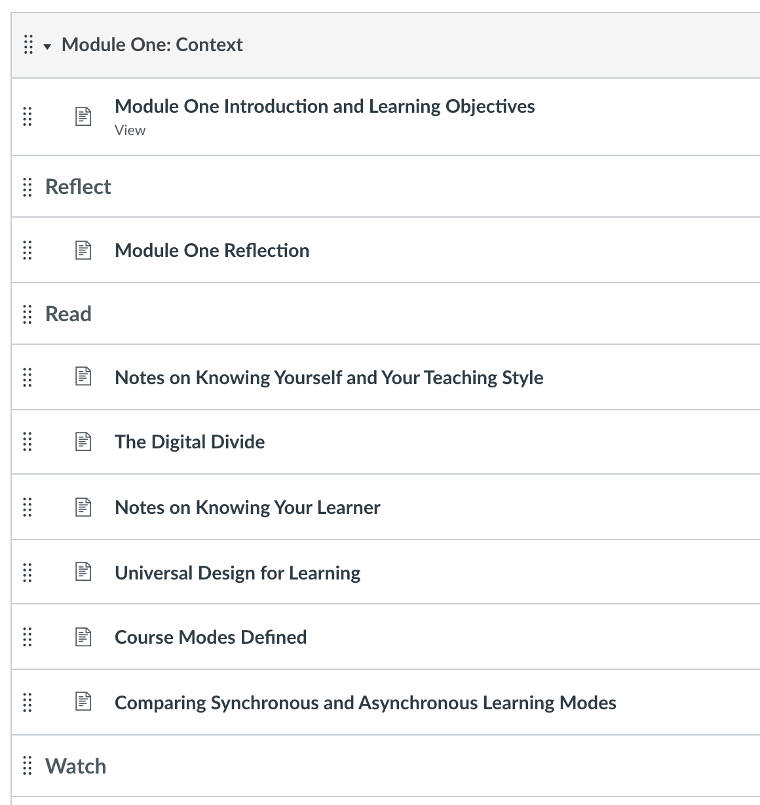
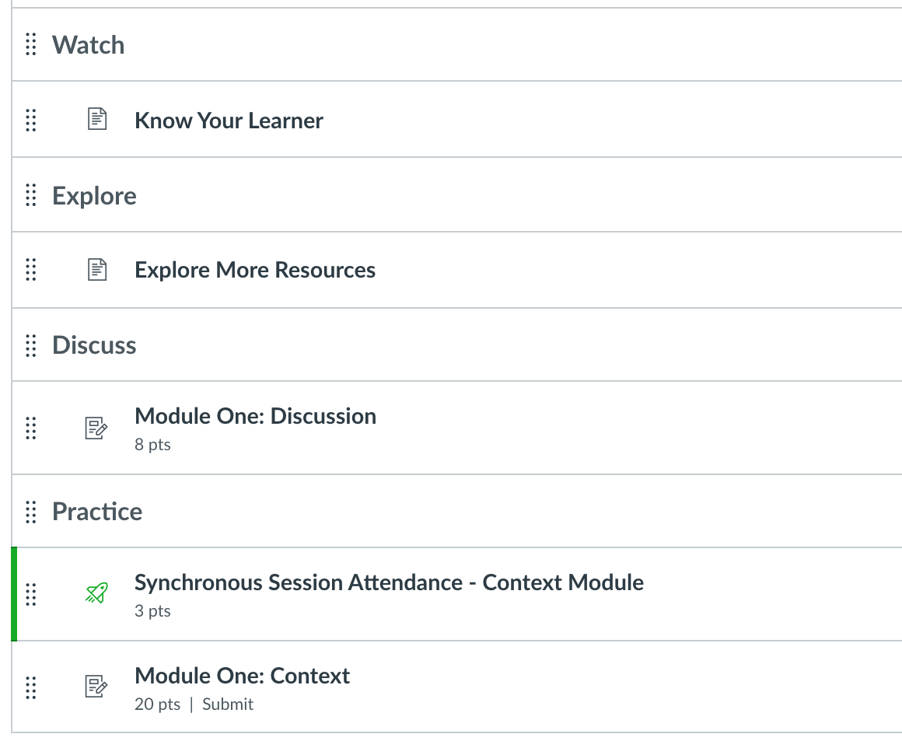

As part of the SJSU Resilient Course Design program, I contributed some approaches to understand the learners in our class better and some strategies for how do they learn best. This was open to all SJSU faculty during Summer 2021 and Winter 2021. Here are some artifacts created during that process.


[Intro](https://youtu.be/bV2jYzBTpzM) | [Knowing your Learner](https://youtu.be/MQj1jpuqjcI) |  [Start of Semester Survey](https://docs.google.com/document/d/1zm1Psi6z3RSAXjXHasgDtauMTR9YuiYcqXdw0ogPB88/edit?usp=sharing) | [Midpoint reflection template](https://docs.google.com/document/d/1wzrBKmvS20UH1OSsJKCJMw7vZT--p5aLU3aUmz6773o/edit?usp=sharing) | [Learner Personas](https://docs.google.com/document/d/1hQIsvNd-jjA3Mu7eifChJGiglGxYe38rxHjROHp9OOU/edit?usp=sharing) | [Slides](https://docs.google.com/presentation/d/12R3PHuUOuXw4wY4q0zU-xeJFalWJj9maS9ccdTPM1Bo/edit?usp=sharing) 

```{r eval=TRUE, echo = FALSE}


```


You can view the whole course [here](https://sjsu.instructure.com/courses/1435257)